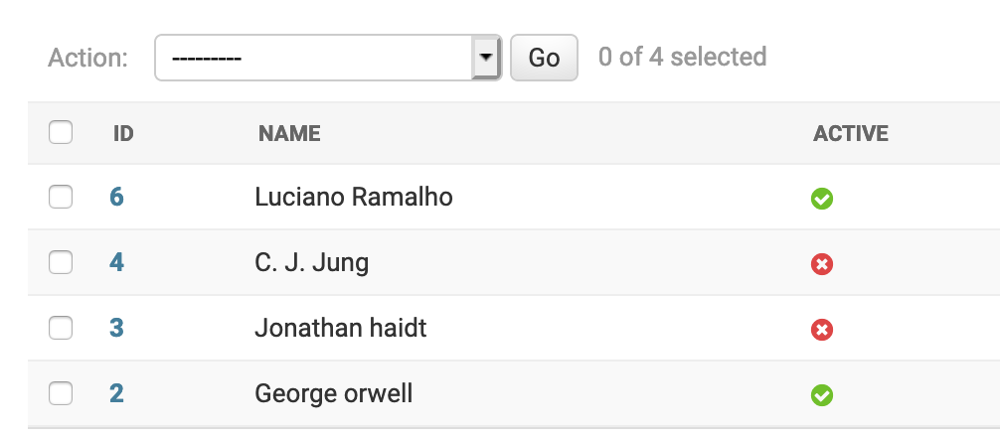

Auto Generate Admin Interface
==================================

Manual Registration
--------------------

Inbuilt admin interface is one the most powerful & popular feature of Django. Once we create the models, we need to register them with admin, so that it can read schema and populate interface for it.

Let us register Book model in the admin interface.

.. code-block:: python

    # file: library/book/admin.py

    from django.apps import apps

    from book.models import Book

    class BookAdmin(admin.ModelAdmin):
        list_display = ('id', 'name', 'author')

    admin.site.register(Book, BookAdmin)

Now, we can see the book model in admin.

.. image:: images/admin-auto-register1.png
   :align: center

If the django project has too many models to be registered in admin or if it has a legacy database where all tables need to be registered in admin, then adding all those models to admin becomes a tedious task.

Auto Registration
------------------

To automate this process, we can programatically fetch all the models in the project and register them with admin. Also, we need to ignore models which are already registered with admin as django doesn't allow regsitering same model twice.

.. code-block:: python

    from django.apps import apps

    models = apps.get_models()

    for model in models:
        try:
            admin.site.register(model)
        except admin.sites.AlreadyRegistered:
            pass

This code snippet should run after all `admin.py` files are loaded so that auto registration happends after all manually added models are registered. Django provides AppConfig.ready() to perform any initialization tasks which can be used to hook this code.

.. code-block:: python

    # file: library/book/apps.py

    from django.apps import apps, AppConfig
    from django.contrib import admin

    class BookAppConfig(AppConfig):

        def ready(self):
            models = apps.get_models()
            for model in models:
                try:
                    admin.site.register(model)
                except admin.sites.AlreadyRegistered:
                    pass

In the admin, we can see manually registered models and automatically registered models. If we open admin page for any auto registered model, it will show something like this.

.. image:: images/admin-auto-register2.png
   :align: center

This view is not at all useful for the users who want to see the data. It will be more informative if we can show all the fields of the model in admin.

Auto Registration With Fields
------------------------------

To achieve that, we can create an admin class to populate model fields in `list_display`. While registering, we can use this admin class to register the model.

.. code-block:: python

    from django.apps import apps, AppConfig
    from django.contrib import admin

    class ListModelAdmin(admin.ModelAdmin):
        def __init__(self, model, admin_site):
            self.list_display = [field.name for field in model._meta.fields]
            super().__init__(model, admin_site)

    class BookAppConfig(AppConfig):

        def ready(self):
            models = apps.get_models()
            for model in models:
                try:
                    admin.site.register(model, ListModelAdmin)
                except admin.sites.AlreadyRegistered:
                    pass

Now, if we look at Author admin page, it will be shown with all relevant fields.

Since we have auto registration in place, when a new model is added or columns are altered for existing models, admin interface will update accordingly without any code changes.

Admin Generator
----------------

The above methods will be useful to generate a pre-defined admin interface for all the models. If independent customizations are needed for the models, then we use 3rd party packages like django-admin-generator or django-extensions which can generate a fully functional admin interface by introspecting the models. Once the base admin code is ready, we can use the same for futher customizations.

.. code-block:: shell

    $ ./manage.py admin_generator books >> books/admin.py

This will generate admin interface for `books` app.

.. [#f1] https://github.com/WoLpH/django-admin-generator

.. [#f2] https://django-extensions.readthedocs.io/en/latest/admin_generator.html
