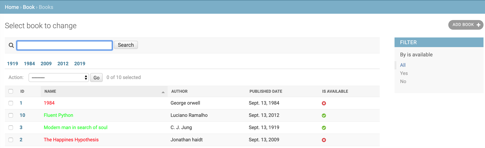
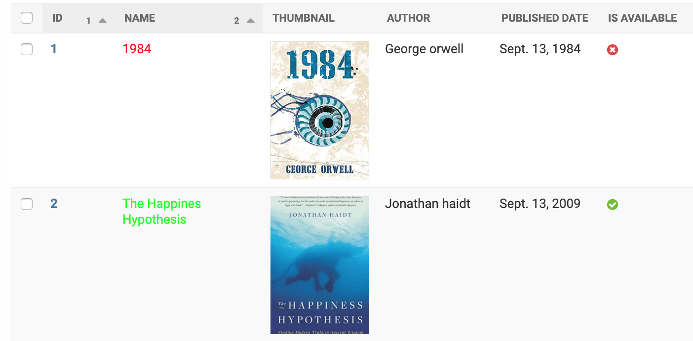
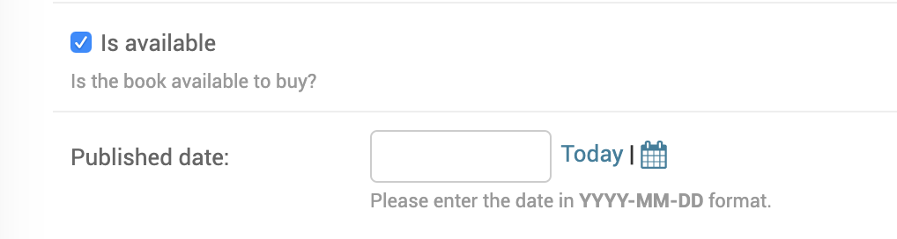
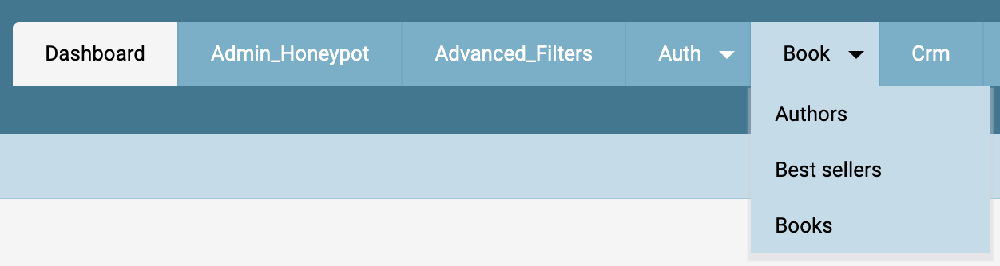

Better Defaults
=================

Use ModelAdmin
-----------------

When a model is registered with admin, it just shows the string representation of the model object in changelist page.

.. code-block:: python

    from book.models import Book

    admin.site.register(Book)

.. image:: images/admin-defaults-list.png
   :align: center

Django provides ModelAdmin [#f1]_ class which represents a model in admin. We can use the following options to make the admin interface informative and easy to use.

* `list_display` to display required fields and add custom fields.
* `list_filter` to add filters data based on a column value.
* `list_per_page` to set how many items to be shown on paginated page.
* `search_fields` to search for records based on a field value.
* `date_hierarchy` to provide date-based drilldown navigation for a field.
* `readonly_fields` to make seleted fields readonly in edit view.
* `prepopulated_fields` to auto generate a value for a column based on another column.
* `save_as` to enable save as new in admin change forms.

.. code-block:: python

    from book.models import Book
    from django.contrib import admin

    @admin.register(Book)
    class BookAdmin(admin.ModelAdmin):
        list_display = ('id', 'name', 'author', 'published_date', 'cover', 'is_available')
        list_filter = ('is_available',)
        list_per_page = 10
        search_fields = ('name',)
        date_hierarchy = 'published_date'
        readonly_fields = ('created_at', 'updated_at')

.. image:: images/admin-defaults-list2.png
   :align: center

In `list_display` in addition to columns, we can add custom methods which can be used to show calculated fields. For example, we can change book color based on its availability.

.. code-block:: python

    @admin.register(Book)
    class BookAdmin(admin.ModelAdmin):
        list_display = ('id', 'name_colored', 'author', 'published_date', 'cover', 'is_available')

        def name_colored(self, obj):
            if obj.is_available:
                color_code = '00FF00'
            else:
                color_code = 'FF0000'
            html = '{}'.format(color_code, obj.name)
            return format_html(html)

        name_colored.admin_order_field = 'name'
        name_colored.short_description = 'name'

Use Better Widgets
-------------------

Sometimes widgets provided by Django are not handy to the users. In such cases it is better to add tailored widgets based on the data.

For images, instead of showing a link, we can show thumbnails of images so that users can see the picture in the list view itself.

.. code-block:: python

    @admin.register(Book)
    class BookAdmin(admin.ModelAdmin):
      list_display = ('id', 'name_colored', 'thumbnail', 'author', 'published_date', 'is_available')

      def thumbnail(self, obj):
        width, height = 100, 200
        html = ''
        return format_html(
            html.format(url=obj.cover.url, width=width, height=height)
        )

This will show thumbnail for book cover images.

Viewing and editing JSON field in admin interface will be very difficult in the textbox. Instead, we can use JSON Editor widget provided any third-party packages like django-json-widget, with which viewing and editing JSON data becomes much intuitive.

.. code-block:: python

    from django.contrib.postgres import fields
    from django_json_widget.widgets import JSONEditorWidget

    @admin.register(Book)
    class BookAdmin(admin.ModelAdmin):
        formfield_overrides = {
            fields.JSONField: {
                'widget': JSONEditorWidget
            },
        }

With this, all JSONFields will use JSONEditorWidget, which makes it easy to view and edit json content.

.. image:: images/defaults-widget3.png
   :align: center

There are a wide variety of third-party packages like django-map-widgets, django-ckeditor, django-widget-tweaks etc which provide additional widgets as well as tweaks to existing widgets.

Better Defaults For Models
--------------------------

We can set user friendly names instead of default names for django models in admin. We can override this in model meta options.

.. code-block:: python

    class Category(models.Model):
        class Meta:
            verbose_name = "Book Category"
            verbose_name_plural = "Book Categories"

Model fields has an option to enter `help_text` which is useful documentation as well as help text for forms.

.. code-block:: python

    class Book(TimeAuditModel):
        is_available = models.BooleanField(
            help_text='Is the book available to buy?'
        )
        published_date = models.DateField(
            help_text='help_text="Please enter the date in <em>YYYY-MM-DD</em> format.'
        )

This will be shown in admin as shown below.

Navigation Menu Bar
-------------------

When user visits a specific model from the admin page, to switch to a different model user has to go back to home page and then move to the required model. This is inconvinient if user has to switch between models frequently.

To avoid this, a navigation menu bar can be added at the top as shown below, so that users can switch between models with just 1 click.

For this, we need to override `base_site.html` template with the navigation menu bar. Django provides `app_list` in the template context which has information about all apps and their models which can be used to render menu bar.

.. code-block:: html

    <ul>
        
        <li><a href="{{ app.app_url }}">{{ app.name }}</a>
            <ul>
                
                    <li><a href="{{ model.admin_url }}">{{ model.name }}</a></li>
                
            </ul>
        </li>
        
    </ul>

.. [#f1] https://docs.djangoproject.com/en/2.2/ref/contrib/admin/#modeladmin-objects
