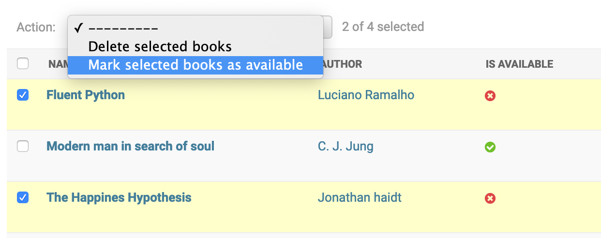

Custom Admin Actions
====================

Allow editing in list view
----------------------------

When a model is heavily used to update the content, it makes to sense to allow bulk edits on the models.

.. code-block:: python

    class BookAdmin(admin.ModelAdmin):
        list_editable = ('author',)

Custom Actions On Querysets
----------------------------

Django provides admin actions which work on a queryset level. By default, django provides delete action in the admin.

In our books admin, we can select a bunch of books and delete them.

.. image:: images/admin-custom-actions1.png
   :align: center

Django provides an option to hook user defined actions to run additional actions on selected items. Let us write write a custom admin action to mark selected books as available.

.. code-block:: python

    class BookAdmin(admin.ModelAdmin):
        actions = ('make_books_available',)
        list_display = ('id', 'name', 'author')

        def make_books_available(self, modeladmin, request, queryset):
            queryset.update(is_available=True)
        make_books_available.short_description = "Mark selected books as available"

Custom Actions On Individual Objects
-------------------------------------

Custom admin actions are inefficient when taking action on an individual object. For example, to delete a single user, we need to follow these steps.

    #. Select the checkbox of the object.

    #. Click on the action dropdown.

    #. Select "Delete selected" action.

    #. Click on Go button.

    #. Confirm that the objects needs to be deleted.

Just to delete a single record, we have to perform 5 clicks. That's too many clicks for a single action.

To simplify the process, we can have delete button at row level. This can be achieved by writing a function which will insert delete button for every record.

ModelAdmin instance provides a set of named URLs for CRUD operations. To get object url for a page, URL name will be `{{ app_label }}_{{ model_name }}_{{ page }}`.

For example, to get delete URL of a book object, we can call `reverse("admin:book_book_delete", args=[book_id])`. We can add a delete button with this link and add it to list_display so that delete button is available for individual objects.

.. code-block:: python

    from django.contrib import admin
    from django.utils.html import format_html

    from book.models import Book

    class BookAdmin(admin.ModelAdmin):
        list_display = ('id', 'name', 'author', 'is_available', 'delete')

        def delete(self, obj):
            view_name = "admin:{}_{}_delete".format(obj._meta.app_label, obj._meta.model_name)
            link = reverse(view_name, args=[book.pk])
            html = '<input type="button" onclick="location.href=\'{}\'" value="Delete" />'.format(link)
            return format_html(html)

Now in the admin interface, we have delete button for individual objects.

.. image:: images/admin-custom-actions3.png
   :align: center

To delete an object, just click on delete button and then confirm to delete it. Now, we are deleting objects with just 2 clicks.

In the above example, we have used an inbuilt model admin delete view. We can also write custom view and link those views for custom actions on individual objects. For example, we can add a button which will mark the book status to available.

In this chapter, we have seen how to write custom admin actions which work on single item as well as bulk items.
