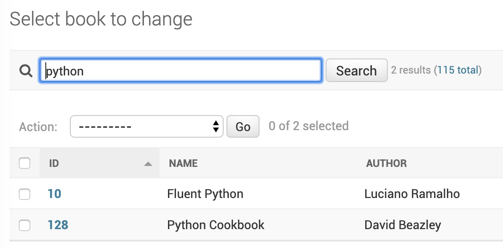
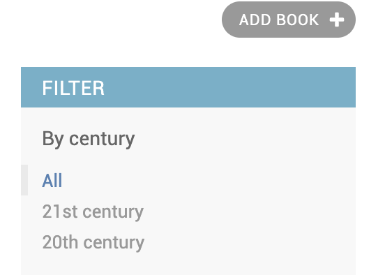

Filtering In Admin
====================

Using search_fields
-------------------

Django Admin provies `search_fields` option on `ModelAdmin`. Setting this will enable a search box in list page to filter items on the model. This can perform lookup on all the fields on the model as well as related model fields.

.. code-block:: python

    class BookAdmin(admin.ModelAdmin):
        search_fields = ('name', 'author__name')

When the number of items in search_fields becomes increases, query becomes quite slow as it does a case-insensitive search of all the search terms against all the search_fields. For example a search for `python for data analysis` translates to this SQL caluse.

.. code-block:: SQL

    WHERE
    (name ILIKE '%python%' OR author.name ILIKE '%python%')
    AND (name ILIKE '%for%' OR author.name ILIKE '%for%')
    AND (name ILIKE '%data%' OR author.name ILIKE '%data%')
    AND (name ILIKE '%analysis%' OR author.name ILIKE '%analysis%')

Using list_filter
-----------------

Django also provides `list_filter` option on `ModelAdmin`. We can add required fields to `list_filter` which generate corresponding filters on the right panel of the admin page with all the possible values.

.. code-block:: python

    class BookAdminFilter(admin.ModelAdmin):
        list_display = ('id', 'author', 'published_date', 'is_available', 'cover')
        list_filter = ('is_available',)

.. image:: images/filter2.png
   :align: center

Using custom filters
--------------------

We can also write custom filters so that we can set calculated fields and add filters on top of them.

.. code-block:: python

    class CenturyFilter(admin.SimpleListFilter):
        title = 'century'
        parameter_name = 'published_date'

        def lookups(self, request, model_admin):
            return (
                (21, '21st century'),
                (20, '20th century'),
            )

        def queryset(self, request, queryset):
            value = self.value()
            if not value:
                return queryset
            start = (int(value) - 1)* 100
            end = start + 99
            return queryset.filter(published_date__year__gte=start, published_date__year__lte=end)

Here the number of choices are limited. But in some cases where the choices are hundred or more, it is better to display a text input instead of choices.

Using advanced filters
----------------------

https://github.com/modlinltd/django-advanced-filters
