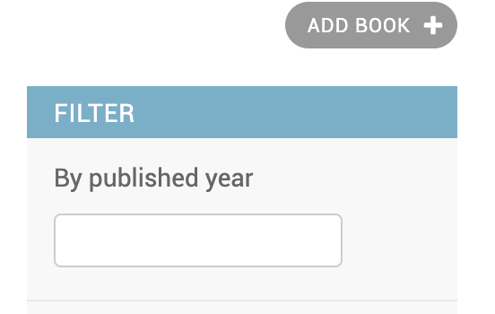
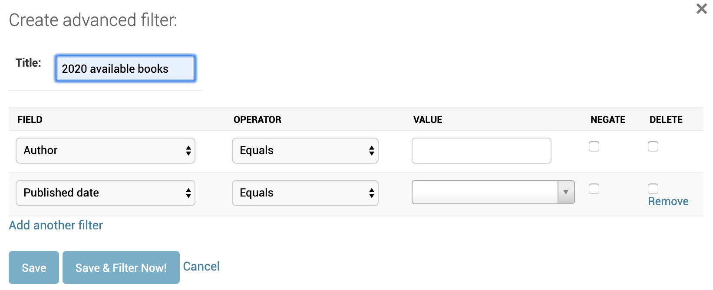

Filtering In Admin
====================

Search Fields
--------------

Django Admin provies `search_fields` option on `ModelAdmin`. Setting this will enable a search box in list page to filter items on the model. This can perform lookup on all the fields on the model as well as related model fields.

.. code-block:: python

    class BookAdmin(admin.ModelAdmin):
        search_fields = ('name', 'author__name')

.. image:: images/filter1.png
   :align: center

When the number of items in search_fields becomes increases, query becomes quite slow as it does a case-insensitive search of all the search terms against all the search_fields. For example a search for `python for data analysis` translates to this SQL caluse.

.. code-block:: SQL

    WHERE
    (name ILIKE '%python%' OR author.name ILIKE '%python%')
    AND (name ILIKE '%for%' OR author.name ILIKE '%for%')
    AND (name ILIKE '%data%' OR author.name ILIKE '%data%')
    AND (name ILIKE '%analysis%' OR author.name ILIKE '%analysis%')

List Filters
-------------

Django also provides `list_filter` option on `ModelAdmin`. We can add required fields to `list_filter` which generate corresponding filters on the right panel of the admin page with all the possible values.

.. code-block:: python

    class BookAdminFilter(admin.ModelAdmin):
        list_display = ('id', 'author', 'published_date', 'is_available', 'cover')
        list_filter = ('is_available',)

.. image:: images/filter2.png
   :align: center

Custom List Filters
-------------------

We can also write custom filters so that we can set calculated fields and add filters on top of them.

.. code-block:: python

    class CenturyFilter(admin.SimpleListFilter):
        title = 'century'
        parameter_name = 'published_date'

        def lookups(self, request, model_admin):
            return (
                (21, '21st century'),
                (20, '20th century'),
            )

        def queryset(self, request, queryset):
            value = self.value()
            if not value:
                return queryset
            start = (int(value) - 1)* 100
            end = start + 99
            return queryset.filter(published_date__year__gte=start, published_date__year__lte=end)

.. image:: images/filter3.png
   :align: center

Custom Text Filter
------------------

Here the number of choices are limited. But in some cases where the choices are hundred or more, it is better to display a text input instead of choices.

Let's write a custom filter to filter books by published year. Let's write an input filter

.. code-block:: python

    class PublishedYearFilter(admin.SimpleListFilter):
        title = 'published year'
        parameter_name = 'published_date'
        template = 'admin_input_filter.html'

        def lookups(self, request, model_admin):
            return ((None, None),)

        def choices(self, changelist):
            query_params = changelist.get_filters_params()
            query_params.pop(self.parameter_name, None)
            all_choice = next(super().choices(changelist))
            all_choice['query_params'] = query_params
            yield all_choice

        def queryset(self, request, queryset):
            value = self.value()
            if value:
                return queryset.filter(published_date__year=value)

This will show in admin like this.

.. code-block:: html

    

    <h3> By {{ filter_title }} </h3>
    <ul>
        <li>
            
                <form method="GET">
                    <input type="text" name="{{ spec.parameter_name }}" value="{{ spec.qvalue|default_if_none:"" }}"/>
                    <input class="btn btn-info" type="submit" value="">
                    
                        <button type="button" class="btn btn-info"><a href="{{ all_choice.query_string }}">Clear</a></button>
                    
                </form>
            
        </li>
    </ul>

https://stackoverflow.com/a/20588975/2698552

Advanced Filters
----------------

All the above methods will be useful only to a certain extent. Beyond that, there are 3rd party packages like `django-advanced-filters` which advanced filtering abilites.

To setup the package

- Install the package with `pip install django-advanced-filters`.
- Add `advanced_filters` to INSTALLED_APPS.
- Add `url(r'^advanced_filters/', include('advanced_filters.urls'))` to project urlconf.
- Run `python manage.py migrate`.

Once the setup is completed, we can add ``

.. code-block:: python

    from advanced_filters.admin import AdminAdvancedFiltersMixin

    class BookAdAdminFilter(AdminAdvancedFiltersMixin, admin.ModelAdmin):
        list_display = ('id', 'name', 'author', 'published_date', 'is_available', 'name')
        advanced_filter_fields = ('name', 'published_date', 'author', 'is_available')

In the admin page, a popup like this will be shown to apply advanced filers.

A simple filter can be created to filter all the books that were published between 1980 to 1990 which have a rating more than 3.75 and number of pages is not more than 100. This filter can be named and saved for later use.

https://github.com/modlinltd/django-advanced-filters

date hierarchy

https://github.com/silentsokolov/django-admin-rangefilter

https://github.com/farhan0581/django-admin-autocomplete-filter
