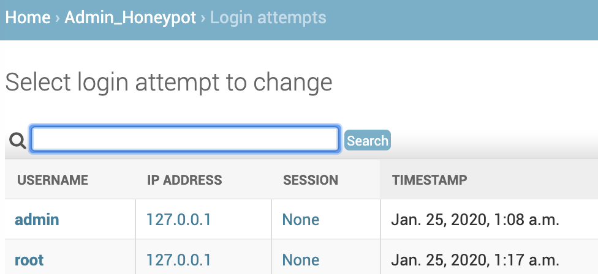
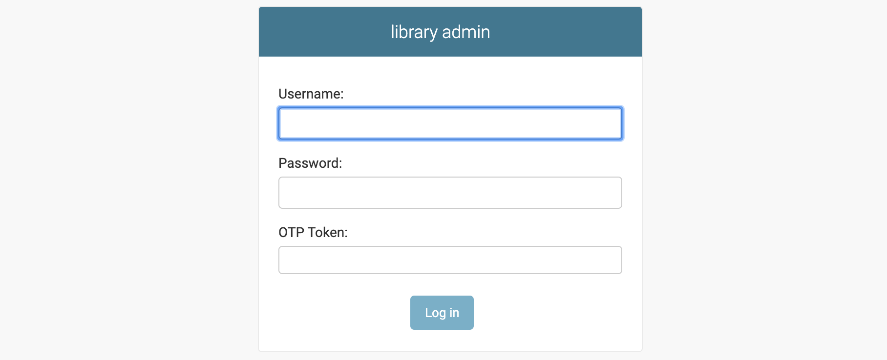

Securing Django Admin
=====================

Once the Django Admin is up and running with required functionality, it is necessary to ensure that it doesn't not have unattended access.

First, the server infrastrucutre needs to be secured. This is topic itself can be written as a seperate book. How to secure a linux server [#f1]_ guide provides detailed instructions on how to secure a server.

Next, we need to ensure our Django application is secure. Django provides documentation [#f2]_ on how to secure a django powered site.

Django provides system check to inspect entire code base and report common issues. We can run this command with `--deploy` which activates additional checks for deployment.

.. code-block:: python

    $ python manage.py check --deploy

In this chapter let us focus at Admin related security measures to make it secure.

.. [#f1] https://github.com/imthenachoman/How-To-Secure-A-Linux-Server
.. [#f2] https://docs.djangoproject.com/en/3.0/topics/security/

Admin Path
----------

Most of the django sites use `/admin/` as the default path for admin interface. This needs to be changed to a different path.

.. code-block:: python

    url(r'^secret-path/', admin.site.urls)

We can write a system check to check if `/admin/` path is used and raise an error.

.. code-block:: python

    from django.conf import settings
    from django.core.checks import Error, Tags, register
    from django.urls import resolve

    @register(Tags.security, deploy=True)
    def check_admin_path(app_configs, **kwargs):
        errors = []
        try:
            default_admin = resolve('/admin/')
        except Resolver404:
            default_admin = None
        if default_admin:
           msg = 'Found admin in default "/admin/" path'
           hint = 'Route admin via different url'
           errors.append(Error(msg, hint))

        return errors

Instead of removing admin, We can also setup a honeypot at the default path which will serve a fake login page. To install honeypot [#f3]_, run `pip install django-admin-honeypot` with pip, add `admin_honeypot` to `INSTALLED_APPS` and set default path to honeypot path in urls.

.. code-block:: python

    url(r'^admin/', include('admin_honeypot.urls', namespace='admin_honeypot'))

Now, we can track all the login attempts on the honeypot admin from the admin page.

.. [#f3] https://github.com/dmpayton/django-admin-honeypot

2 Factor Authentication
-----------------------

To make Admin more secure, we can enable 2 step verification where user has to provide 2 different authentication factors, one is password and the other is OTP generated from user mobile.

For this, we can use `django-otp` [#f4]_ package and create a custom admin config to replace default admin site.

.. [#f4] https://pypi.org/project/django-otp/

Install the package with `pip install django-otp`, add `django_otp`, `django_otp.plugins.otp_totp` to installed apps and run `./manage.py migrate`.

In the admin page, under `OTP_TOTP` section add new device so that we can generate OTP for the admin page.

Create 2 files admin.py & apps.py in the project package to create custom admin config for OTPAdminSite and set it as default.

.. code-block:: python

     from django_otp.admin import OTPAdminSite

     class LibraryOTPAdminSite(OTPAdminSite):
         pass

.. code-block:: python

    from django.contrib.admin.apps import AdminConfig

    class LibraryAdminConfig(AdminConfig):
        default_site = 'library.admin.LibraryOTPAdminSite'

In the `INSTALLED_APPS`, replace admin with custom config.

.. code-block:: python

    INSTALLED_APPS = [
        # 'django.contrib.admin',
        'library.apps.LibraryAdminConfig',
    ]

Now the admin login page will show OTP login form.

Environments
------------

When the django app is deployed in multiple environments, it is important to distinguish those environments visually so that admin users accidentally don't modify data in production environments. For this we can ovveride the base template with a custom template.

https://github.com/dizballanze/django-admin-env-notice

Miscellaneous
-------------

If you have user groups and permissions, it is important to set permissions on object level.

When using `ModelAdmin.get_urls()` to extend urls, Django by default doesn't do any permission checks and the view is accessible to public. Ensure that these views are secure by wrapping them with `admin_view`.

.. code-block:: python

    class BookAdmin(admin.ModelAdmin):
        def get_urls(self):
            urls = super().get_urls()
            book_urls = [
                path('book_char_data/', self.admin_site.admin_view(self.chart_data))
            ]
            return book_urls + urls
